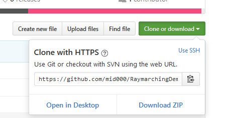
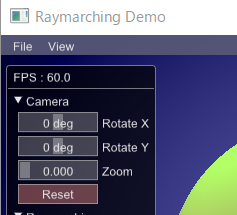
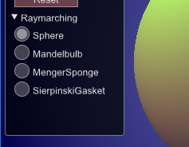
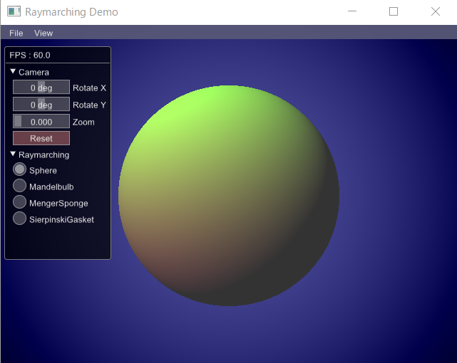
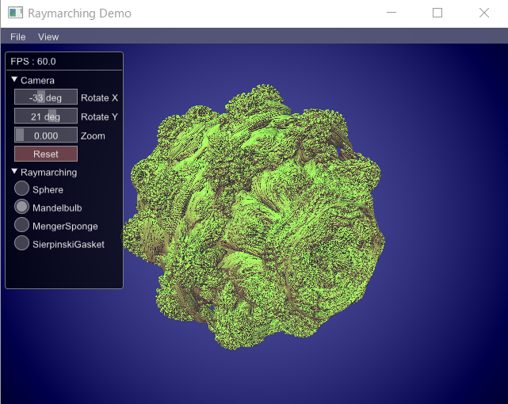
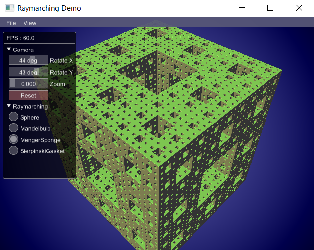
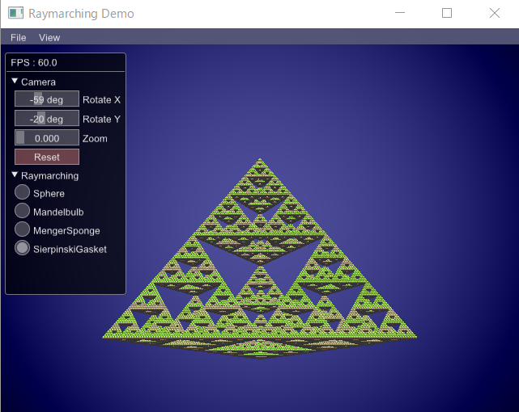

#RaymarchingDemo

- [概要](#概要)
- [ダウンロード](#ダウンロード)
- [起動方法](#起動方法)
- [操作方法](#操作方法)
- [種類](#種類)
- [使用ライブラリ](#使用ライブラリ)
- [スクリーンショット](#スクリーンショット)

##概要
Raymarching(レイマーチング)技術のデモプログラムです。  
モデルリソースなどを使用せず、シェーダー内の処理で3Dの物体を描画します。  

##ダウンロード
https://github.com/mid000/RaymarchingDemo  
上記ページの「Clone or download」から「Download ZIP」を選択して任意の場所にダウンロードし解凍してください。  

##起動方法
ダウンロードしたフォルダ内の下記exeをダブルクリックで実行してください。  
\RaymarchingDemo-master\RaymarchingDemo\  
RaymarchingDemo.exe  

##操作方法
- **マウス左クリックしたまま移動：**カメラ回転
- **マウスホイールのスクロール：**ズーム

画面左のGUIで回転（X,Y）、ズームを個別で変更できます。  
Resetボタンで初期値に戻ります。  

##種類
画面左のGUIに表示されているラジオボタンで表示物の変更ができます。  
- Sphere
- Mandelbulb
- MengerSponge
- SierpinskiGasket

##使用ライブラリ
- GLEW
- GLFW
- Imgui
- stb（Imguiが使用）

##スクリーンショット

